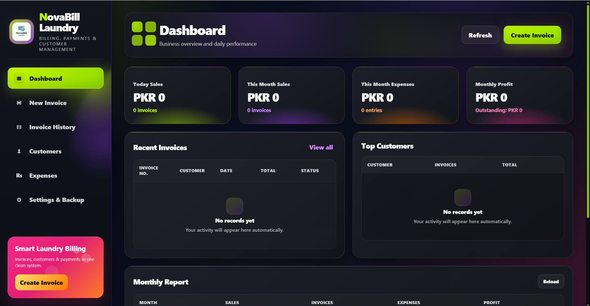
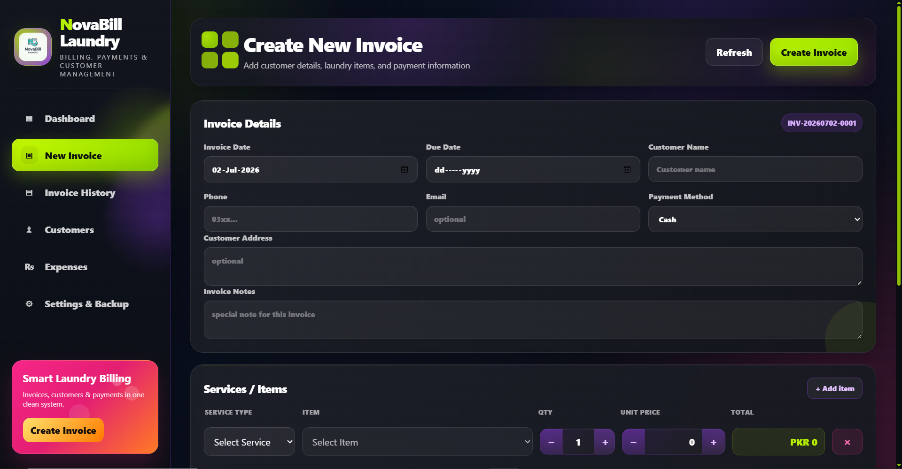
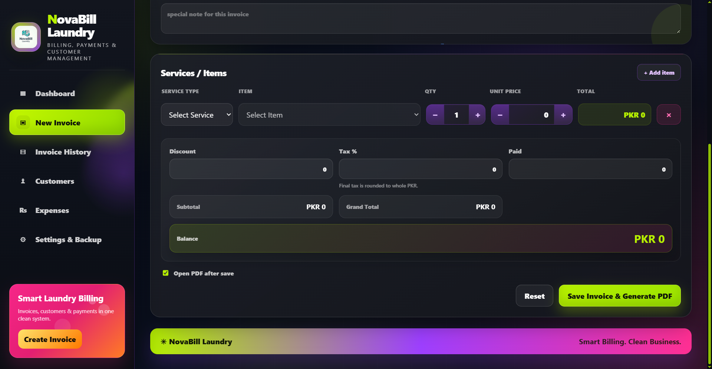

# NovaBill Laundry Billing System

**Version:** v1.0.0  
**Status:** Final  
**Scope:** Single PC / Single User / Whole-PKR Laundry Billing Desktop App

NovaBill Laundry is a local-first desktop billing system built for small laundry businesses. It helps a shopkeeper create invoices, manage customers, track payments, generate professional PDF invoices, record expenses, review business performance and safely manage local backups from a clean desktop interface.

---

## Screenshots

### Dashboard

### Create Invoice Form

### Create Invoice Items & Totals

---

## Project Overview

NovaBill Laundry is designed as an offline desktop application for a single laundry shop using one computer. The app focuses on simple billing, customer records, payment tracking, invoice PDFs, expenses, reports and local data safety.

The project uses a Python backend with a PyWebView desktop shell, SQLite database, ReportLab PDF generation and a modern HTML/CSS/JavaScript frontend.

This version is finalized as a portfolio-ready desktop business application.

---

## Features

- Dashboard with sales, expenses, profit and outstanding balance
- Create and edit laundry invoices
- Required and unique customer phone numbers
- Phone-based customer deduplication
- Service type, item, quantity, unit price and total workflow
- Auto price fill with editable unit price
- Unique invoice numbering: `INV-YYYYMMDD-0001`
- Whole-PKR financial model
- Tax, discount, paid amount and balance validation
- Paid, Partial, and Unpaid payment status tracking
- Professional PDF invoice generation
- Missing PDF regeneration support
- Invoice history with search, filters, open, print and delete
- Customer management
- Expense management
- Monthly business reports
- Backup and restore with safety validation
- Schema migration ledger
- Backend safety tests
- Frontend money-logic tests
- Dependency audit wrapper
- Windows EXE build support using PyInstaller

---

## Tech Stack

| Technology  | Purpose                         |
|-------------|---------------------------------|
| Python      | Backend logic and service layer |
| PyWebView   | Desktop app window              |
| SQLite      | Local database                  |
| ReportLab   | PDF invoice generation          |
| Pillow      | Logo and image handling         |
| HTML        | UI structure                    |
| CSS         | App styling and layout          |
| JavaScript  | Frontend logic and API calls    |
| PyInstaller | Windows EXE packaging           |

---

## Engineering Highlights

- Local-first desktop architecture
- Python service-layer validation
- SQLite `CHECK` constraints for financial safety
- Whole-PKR money model
- Required and unique phone-based customer records
- Safe backup and restore flow with validation
- Automatic PDF regeneration flow
- Shared frontend money-logic module
- Schema migration tracking
- Invoice-number retry safety
- Backend and frontend logic tests
- Dependency audit wrapper for release checks
- Clean final source structure for GitHub and portfolio presentation

---

## Project Scope

This project is intentionally designed for:

- Single shop
- Single computer
- Single user
- Offline/local-first usage
- Whole-PKR billing

This version does not include:

- Multi-user login
- Cloud database
- SaaS subscription system
- Online web deployment of the desktop app

---

## Future Improvements

These ideas are outside the current v1.0.0 scope and can be considered for a future version:

- Installer setup
- WhatsApp invoice sharing
- QR code payment support
- Thermal printer support
- Sales charts on dashboard
- Advanced customer analytics
- Cloud backup option
- Multi-user/login support
- SaaS version with cloud database and accounts

---

## Final Status

This is the finalized version of the project. No further feature changes are planned for v1.0.0.

---

## License

This project is provided for educational purposes. See the `LICENSE` file for details.
